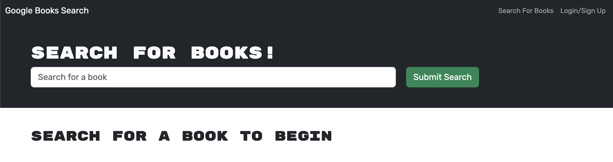
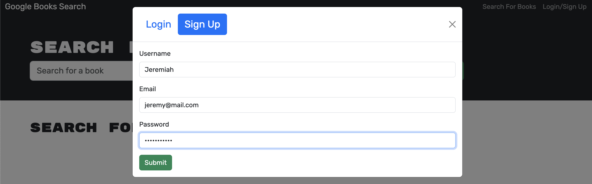
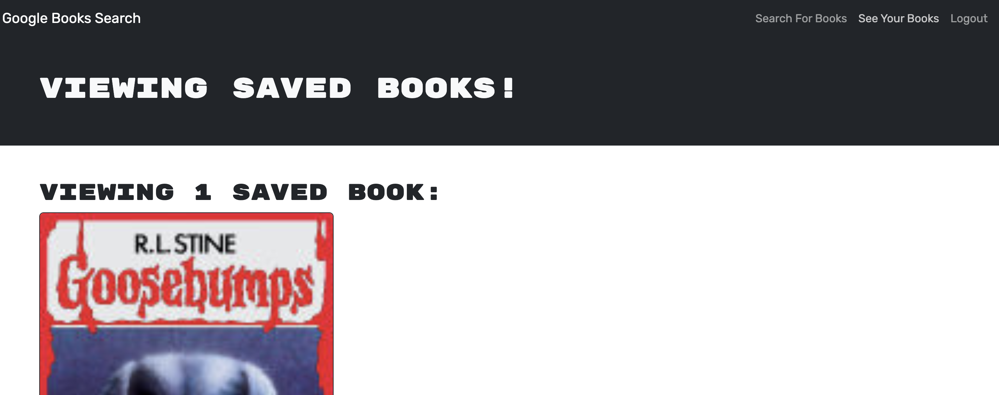

  # Book Search Engine
  
  ## Table of Contents
  1. [Instructions](#1-instructions)
  2. [Description](#2-description)
  3. [Contribution Guidelines](#3-contribution-guidelines)
  4. [Testing the Application](#4-testing-the-application)
  5. [License](#5-license)
  6. [Questions](#6-questions)

  ## 1. Instructions
  Access the webpage with this link below:
  
  [Book Search Engine](https://book-search-engine-akjj.onrender.com/)

  This is currently only a web based application, so no installation is required.

  ## 2. Description

  The purpose of this application is to give a user the ability to create an account, search for books with the Google Books API, and save the books they are interested in to their personal saved books page.

  On first navigating to the webpage, the user is presented with a search bar that can be used immediately without an account or being logged in. If the user would like to be able to save their searched books to their page, they will need to click "Login/Sign Up" in the top right.

  

  On the Login/Signup popup, the user can choose to enter their credentials to log back into their account or create a new account.

  

  Once logged in, the user can search for books and should see a button to save books to their list. If the book has already been added, the user will not be able to add it again.

  

  The user can then navigate to their personal page with the "See Your Books" option in the top right to see all of the books that have been saved with an option to delete them from this page if desired.

  
   
   
  

  ## 3. Contribution Guidelines
  The source code was provided by the SMU Coding Bootcamp, so only approved contributions by them are allowed.

  ## 4. Testing the Application
  Users are able to create user accounts to test the search and save features of the web page.

  ## 5. License
  MIT 
  https://opensource.org/licenses/MIT

  ## 6. Questions:
  Contact me with questions at: 
    - Github: *jeremydray* 
    - Email: *jeremydray@gmail.com*
